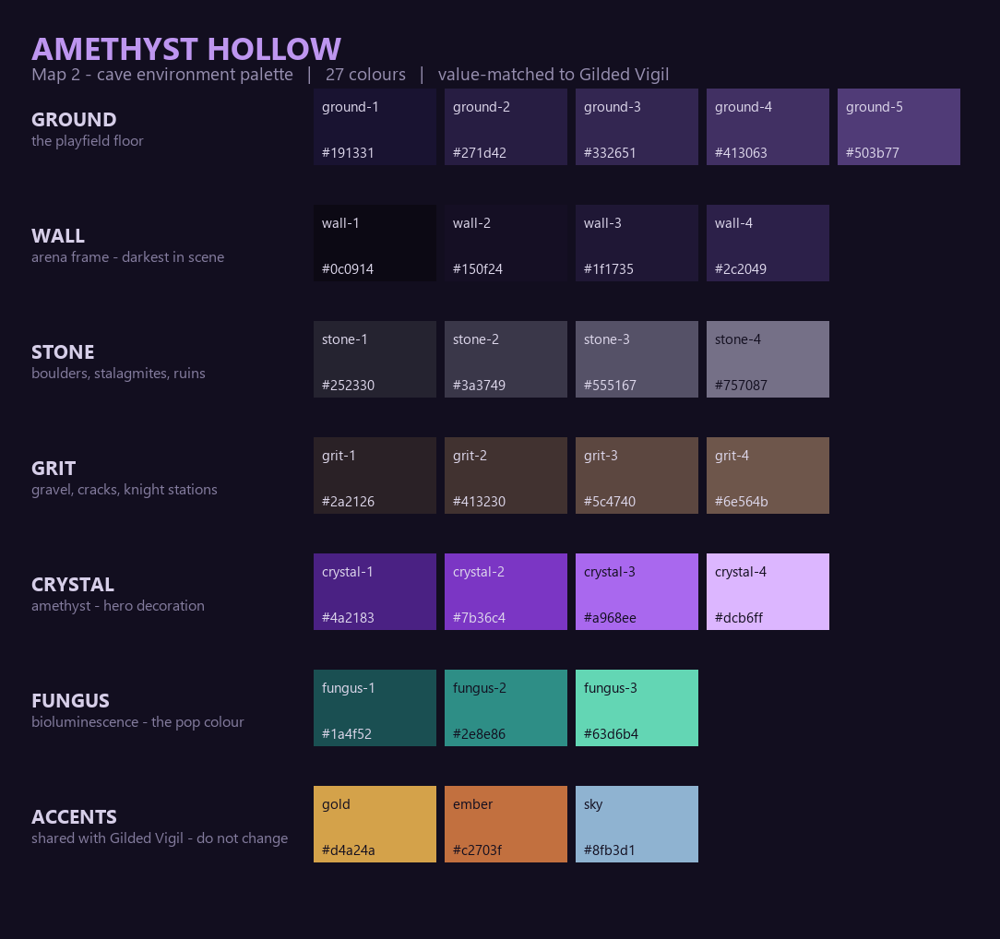
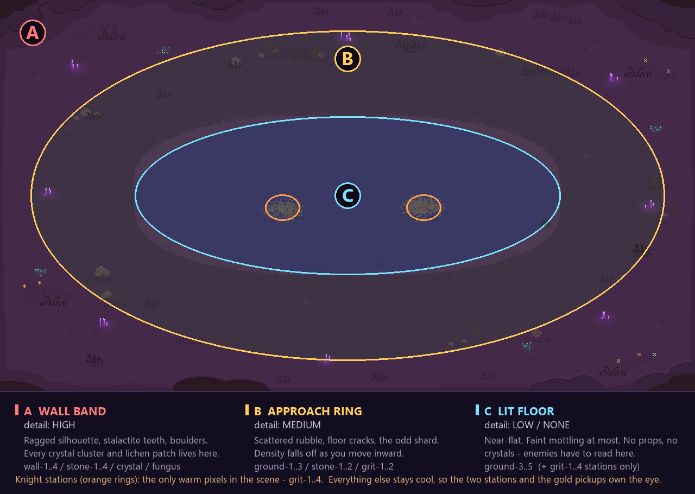
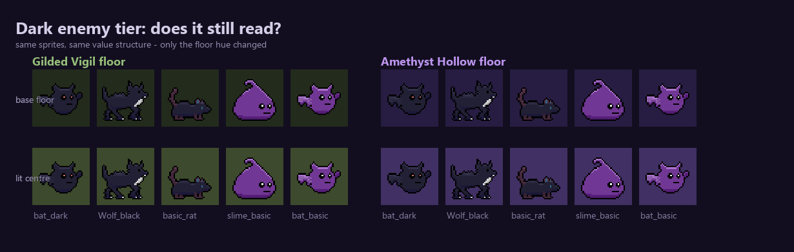

# Amethyst Hollow — Map 2 cave palette

The cave counterpart to Gilded Vigil. 27 colours in 7 groups.

The governing rule: **the cave is a hue rotation of Gilded Vigil, not a re-lighting of it.**
Every group is value-matched to its forest equivalent, so the arena's vignette → lit-centre
read that already works transfers unchanged. Only hue and saturation move.

| group | n | role | forest equivalent |
|---|---|---|---|
| `ground` | 5 | the playfield floor | `gilded-vigil-ground` |
| `wall` | 4 | arena frame, darkest values in scene | `gilded-vigil-pine` |
| `stone` | 4 | boulders, stalagmites, ruins | `gilded-vigil-stone` |
| `grit` | 4 | gravel, cracks, knight stations | `gilded-vigil-dirt` |
| `crystal` | 4 | amethyst — hero decoration | *(new)* |
| `fungus` | 3 | bioluminescence — the pop colour | *(new)* |
| `accents` | 3 | pickups, embers | **identical** to `gilded-vigil-accents` |

`accents` is byte-for-byte the forest's accent group on purpose. Gold means *pickup* on every
map; the moment that shifts per-biome the player has to relearn it.

## Files

**Aseprite strips** — `Assets/Graphics/palletes/`, same convention as the existing strips
(N×1 RGB, one layer named after the file, dark → light, sprite palette embedded):

`background_cave` · `cave_wall` · `cave_stone` · `cave_grit` · `cave_crystal` · `cave_fungus` · `cave_full`

`cave_full.aseprite` is all 27 in one row — open it, then **Palette ▸ options ▸ Load palette
from sprite** and you have the whole environment in one click. The per-group strips are for
palette-swap work and for keeping a single ramp in front of you while you paint.

**GPL groups** — `Docs/Design/Palettes/amethyst-hollow-*.gpl`, plus a combined
`amethyst-hollow-environment.gpl` and a flat `amethyst-hollow-environment.hex`.
Aseprite loads `.gpl` directly via **Palette ▸ Load Palette**.

## Painting the overhead map

The arena is 640×360. The lit centre ellipse measures x 123–515, y 107–252 in the existing art —
centre ≈ (320, 180), radii ≈ (196, 73). Three bands, and the whole design is about **spending
detail where the player isn't looking and withholding it where they are.**

### Zone C — the lit floor. Leave it alone.

This is the ellipse the knights stand in and where every enemy converges. It gets `ground-3..5`
and **nothing else**. No boulders, no crystals, no cracks, no lichen. At most a very faint
1-value mottle (`ground-3` speckle on `ground-4`) at under ~2% coverage, and only if it looks
dead without it.

Every pixel of decoration you put here is a pixel competing with a wolf. The forest map already
gets this right — the bright ellipse is nearly flat — and it's the single most important thing
to carry over.

The two knight stations are the exception: `grit-1..4`, roughly 40×24 each at (260, 191) and
(390, 191). These are the **only warm pixels in the scene**. Everything else is cool, which is
what makes the stations and the gold pickups own the eye.

### Zone B — the approach ring. Sparse and falling off.

From the centre ellipse out to roughly rx 292 / ry 152. `ground-1..3` for the floor, with
`stone-1..2` rubble and `grit-1..2` cracks scattered thinly. **Density should fall off as you
move inward** — heavy near the wall, nearly nothing by the time you touch Zone C. That gradient
is what makes the centre feel lit rather than just paler.

Cracks read best as 1px `grit-1` lines with an occasional `grit-2` pixel, running roughly
radially. Rubble is 2–4px clumps: `stone-2` body, `stone-1` on the shadow side, single `stone-3`
pixel on top.

### Zone A — the wall band. Spend everything here.

Outside the ring. This is where the map earns its character:

- **Silhouette first.** The ragged `wall-1` edge is the strongest shape in the frame. Give it
  irregular bite — stalactite teeth hanging down from the top edge, up from the bottom. Vary the
  depth a lot; regular scalloping reads as decoration, irregular reads as rock.
- **`wall-1..4` for the rock face**, with `wall-4` catching light on edges that face the centre.
  That one light-facing rim is what sells "the cave is lit from the middle."
- **Boulders and stalagmites** in `stone-1..4`, largest at the corners.
- **All crystal clusters and all lichen live here.**

### Crystals — the hero decoration

Clusters, never fields. 3–5 shards, 3–7px tall, `crystal-2` body, `crystal-1` on the shadow
side, `crystal-3` on the lit face, a single `crystal-4` pixel at the tip. Then bleed a soft glow
onto the surrounding floor — pull nearby floor pixels ~30% toward `crystal-2` over a radius of
about 12px.

Six to eight clusters across the whole map is plenty. They're the brightest saturated thing in
the scene; a dozen and they stop being special.

### Fungus — use less than you think

`fungus` is the near-complement of the floor, so it screams. Small patches of 8–10 pixels,
four or five patches on the whole map, wall band only. It exists to keep the map from being
monochrome, not to be a feature.

Don't put crystals and fungus in the same corner — they fight. Alternate them around the perimeter.

### Order of operations

1. Flood `ground-2`, lay in the ellipse (`ground-3` → `ground-4`, `ground-5` on the inner rim).
2. Cut the wall silhouette in `wall-1`, then build the face inward with `wall-2..4`.
3. Knight stations in `grit`.
4. Rubble and cracks in Zone B, falling off inward.
5. Crystals and fungus last, wall band only.
6. **Squint test.** Blur it mentally — you should see one bright ellipse, two warm dots, a dark
   irregular frame, and a handful of violet sparks. If you see texture noise anywhere in the
   middle, delete it.

## Reference images

- `amethyst-hollow-recolor.png` — the existing arena recoloured role-for-role, no new decoration.
  What a pure palette swap gets you.
- `amethyst-hollow-mock.png` — the same, plus procedurally-placed crystals and lichen, to show
  density.

**These are references, not art.** They were generated by recolouring the current
`BackGround_Cave.aseprite` to check that the ramp holds up; nothing in `Assets/` was modified.
Note especially that the forest's grass-tuft silhouettes survive the recolour and still read as
*grass* — in a real repaint those shapes need replacing with rubble and cracks, not just recolouring.

## ⚠ Open issue: the shadow-purple enemy tier disappears

`slime_basic` and `bat_basic` use `purple-1..4` (`4c196c`–`ab74cd`). On a violet floor they stop
being readable. Mean sprite colour vs floor colour, CIE Lab ΔE:

| sprite | Gilded Vigil base / lit | Amethyst Hollow base / lit |
|---|---|---|
| `bat_basic` | 56.3 / 63.4 | 22.6 / **12.0** |
| `slime_basic` | 61.6 / 68.4 | 27.9 / **17.1** |
| `bat_dark` | 24.1 / 37.2 | 15.4 / 26.9 |
| `Wolf_black` | 22.6 / 35.4 | 16.0 / 26.9 |
| `basic_rat` | 24.1 / 36.9 | 14.9 / 26.1 |

ΔE 12 is near-camouflage, and it's worst on the **lit centre** — exactly where those enemies
converge on the knights. The dark tier drops about a third and stays workable; the purple tier
collapses by 82%.

This is a palette-collision problem, not a bug in the ramp, and it wants a decision rather than
a silent fix. Options, roughly in order of how much they cost:

1. **Don't spawn the purple tier in the cave.** Free. Map 2 leans on the grey/brown/dark tiers
   and the purple mobs stay a Gilded Vigil signature.
2. **Give purple-tier mobs a rim light in the cave** — a 1px `fungus-3` or `crystal-4` outline.
   Cheap, and "the cave lights them from behind" is coherent.
3. **Shift the cave floor cooler**, toward indigo, and pull saturation down. Recovers some ΔE
   but costs the amethyst identity you asked for.
4. **Retint the purple tier** for map 2. Most expensive, and it breaks a sprite palette shared
   with map 1.

Option 1 or 2 is what I'd do — neither touches the existing art. Nothing has been changed either
way; the enemy palettes are untouched.
