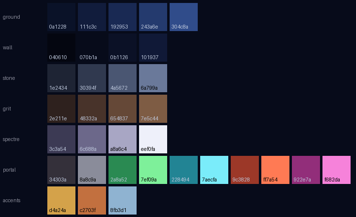
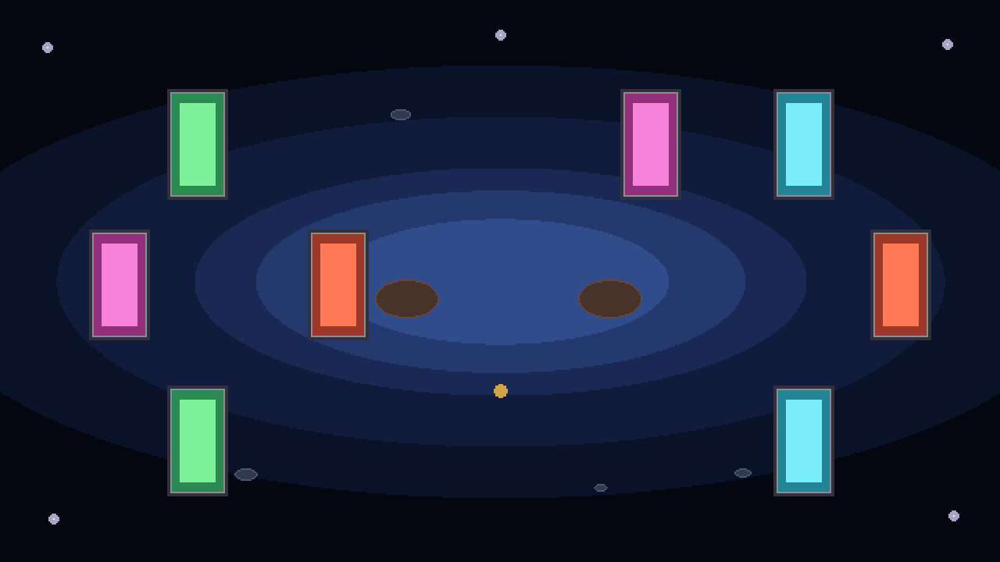

# Map 3 — Pallid Keep

*Drafted 2026-08-18. Follows The Mine. Status: design only, nothing built.*

A haunted, abandoned castle. Where the Mine's signature was rails and carts, this map's
signature is **mirrors that work as portals** — a shot goes in one pane and comes out of
its twin somewhere else on the board.

## The one-line idea

**Everything in this castle hides behind a shield, and portals are how you get around them.**

The joke is that the shield is the knights' own trick. The keep is full of dead knights who
learned it, and every enemy on the map is built around presenting armour to the thing
shooting at it. Portals are the answer to that, so the enemies and the mechanic explain
each other — the same relationship carts have with rails.

## The portals

A pane is a tall mirror standing on the floor. Shots pass through it and come out of the
matching pane.

**Rules:**

1. **Only projectiles go through.** Arrows, fireballs, shuriken, enemy shots. Not enemies,
   not the knights, not pickups. The one exception is a boss wave (below).
2. **Colour is the pairing.** Green goes to green. A colour appears exactly twice on the
   board and those two panes are twins. There are four colours, so at most four pairs —
   but see the note on how many to actually use.
3. **Direction is preserved.** An arrow travelling right when it enters comes out
   travelling right.
4. **Both faces work.** A pane is not one-way.
5. **A pane can move.** Most panes are stationary; some ride a fixed path, the same way a
   cart rides a rail. Never a random path — this map obeys the same no-randomness rule as
   every other wave in the game.
6. **For a moving pane, work out the exit at the moment the shot enters** and don't track
   the pane afterwards. Simplest to build, and much easier for the player to read.
7. **Your own arrow can come back at you.** A badly-read pair puts your shot into your own
   knight. Keep this. It makes the shield matter and it is a fair thing to learn.

**How many pairs at once:** four pairs is eight panes and that is too much furniture for a
normal wave — the mock in `Palettes/pallid-keep-mock.png` shows all eight and it reads as
clutter. Two pairs is the normal case, three for a busy wave, four only for something
special. The fourth colour exists so waves can differ from each other, not so one wave can
use everything.

### Open question: pane orientation

The pane art is 32×64 — taller than wide. A tall pane naturally catches shots travelling
roughly horizontally. If every pane on the map is tall, vertical shots can never be
redirected, which throws away half the arena.

Recommendation: author a horizontal variant too (64×32, the same art rotated), and let a
layout place either. It costs nothing in art and doubles what a wave can express.

## The enemies

### The Sworn — skeletons with shields

*(Naming is open. "The Sworn" = the dead garrison still standing its post.)*

A skeleton that holds a shield straight out in front of it. **It cannot be hurt through the
shield.** It walks in straight lines, and it always walks in one of two lanes:

| tell | approach | then |
|---|---|---|
| **blue shoes** | walks to a point 3 units to the side of a knight | turns and walks a straight **horizontal** line at that knight |
| **red shoes** | walks to a point 2 units above or below a knight | turns and walks a straight **vertical** line at that knight |

It targets whichever knight it spawned closer to.

**The shield faces the way the skeleton is walking, not the knight.** This is the whole
enemy. While it is crossing to its lane it is angled and exposed; the moment it turns into
the lane, it is armoured against the knight it is walking at. So each skeleton gives you a
window with a clear start and a clear end, and once that window closes the answer has to
come from somewhere else: the *other* knight shooting it side-on, or an arrow through a
portal arriving behind it.

The shoe colour is the tell. The player learns to read feet and knows which lane is about
to be occupied before the skeleton gets there.

### The Warden — the big one

A suit of empty plate armour that stands up when the wave starts. No skeleton inside. It
drags a tower shield that **slides up and down in front of it on a fixed cycle**, so there
is a gap that opens above it and then below it, over and over. You time your shot to the
gap.

Deterministic and readable, and it rewards the bowsight. "Dead castellan still standing his
post" needs no explanation in a haunted castle.

*(Alternative name: Hollow Sentinel.)*

## Art specs

Everything on this map follows the project's existing conventions — 32 PPU, so a 32×32
sprite is 1 world unit, and size comes from the `scale` field rather than a bigger canvas
(see `EnemyGiantSlime.Config.scale`, where the giant is `6` and a size-3 slime is `3`).

| thing | canvas | scale | world size | notes |
|---|---|---|---|---|
| Sworn (skeleton) body | 32×32 | 1 | 1×1 | same as every other mob |
| Sworn shield | 32×32 | 1 | 1×1 | separate child sprite so it can face the walk direction |
| Warden body | 32×32 | 2 | 2×2 | "size two slime" |
| Warden shield | 32×32 | 2 | 2×2 | **must be its own sprite on its own child object**, or it cannot slide |
| Portal pane (tall) | 32×64 | 1 | 1×2 | as tall as the Warden; clearly tall enough to walk through |
| Portal pane (wide) | 64×32 | 1 | 2×1 | proposed variant, see open question above |

The shields being separate objects is the important one. Bake a shield into a body sprite
and it can never move independently, which kills both enemies.

## The boss wave — enemies go through

Everywhere else on the map, portals take projectiles only. The map's boss breaks its own
rule: **on the boss wave, enemies go through the panes too.**

That is the whole reveal. Twenty waves of learning that panes are a tool you aim through,
and then the thing at the end walks through one. It costs no new system — it is a flag on
the wave — and it re-teaches the entire map in one moment.

Left open: whether the boss itself travels through panes, whether only its adds do, or both.
Whether this is the gate boss or the true boss depends on how long the map runs.

## Map shape

Nothing here is decided. Sketch, following the pattern in `orders-and-the-full-run.md`
(Map 1 ≈ 10 waves, Map 2 ≈ 15, later maps 20–30):

- `mapId` `pallid_keep`, roughly 20 waves.
- Unlocked by beating the Mine's gate (`unlocksMapId` on The Mine).
- Gate boss and true boss both open.
- A `PortalLayout` ScriptableObject, sibling to `RailLayout`: a list of panes with a
  position, an orientation, a colour, and an optional path to ride. Waves name a layout
  rather than hardcoding coordinates, exactly as the Mine's waves do.

## Palette — Pallid Keep

34 colours in 7 groups. Deep midnight blue, not grey-blue.

| group | n | role |
|---|---|---|
| `ground` | 5 | the playfield floor |
| `wall` | 4 | arena frame, darkest values in the scene |
| `stone` | 4 | fallen pillars, statuary, rubble |
| `grit` | 4 | rot, rust, knight stations — the warm group |
| `spectre` | 4 | corpse-candles, ghostlight — hero decoration |
| `portal` | 10 | frame pair + four twins, each a body and a glow |
| `accents` | 3 | **identical** to `gilded-vigil-accents` |

Three things drove the colour choices:

- **The floor is saturated, not washed out.** Deep blue reads as midnight; pale blue-grey
  reads as overcast. This map runs a little darker overall than the other two, and
  ArenaLighting is expected to lift the centre.
- **Ghostlight pops by value, not hue.** `spectre-4` is the brightest colour on the map by
  a wide margin. That is what makes a deep blue room feel haunted rather than merely dark.
  It gave up cyan to the portals and became bone-white with a lilac cast.
- **No portal is amber or gold.** `accent-gold` means "pickup" on every map and a portal
  must never be mistaken for one. Vermilion is the closest approach and stays clearly
  red-orange against gold's muted yellow.

### Files

**Aseprite strips** — `Assets/Graphics/palletes/`, matching the existing convention
(N×1 RGB, one frame, one layer named after the file, dark → light, palette embedded):

`background_keep` · `keep_wall` · `keep_stone` · `keep_grit` · `keep_spectre` ·
`keep_portal` · `keep_full`

`keep_full.aseprite` is all 34 in one row — open it, then **Palette ▸ options ▸ Load palette
from sprite**.

**GPL groups** — `Docs/Design/Palettes/pallid-keep-*.gpl`, plus a combined
`pallid-keep-environment.gpl` and a flat `pallid-keep-environment.hex`.

## Open questions

1. Pane orientation — tall only, or tall and wide? (Recommend both.)
2. Is the map name right? `Pallid Keep` was picked to sit alongside `Gilded Vigil` and
   `Amethyst Hollow`.
3. Do the Sworn have a ranged attack, or are they purely a body walking at you?
4. What happens when a pane's twin is destroyed or missing — does the pane go dark?
5. Does the Warden move at all, or is it a stationary wall you have to solve?
6. Enemy readability against a deep blue floor has not been checked. The cave hit exactly
   this problem (see `Palettes/amethyst-hollow.md`, the purple-tier collision) and it wants
   the same ΔE pass before any enemy art is committed. Bone-white skeletons should be safe;
   the dark tier is the one to measure.
